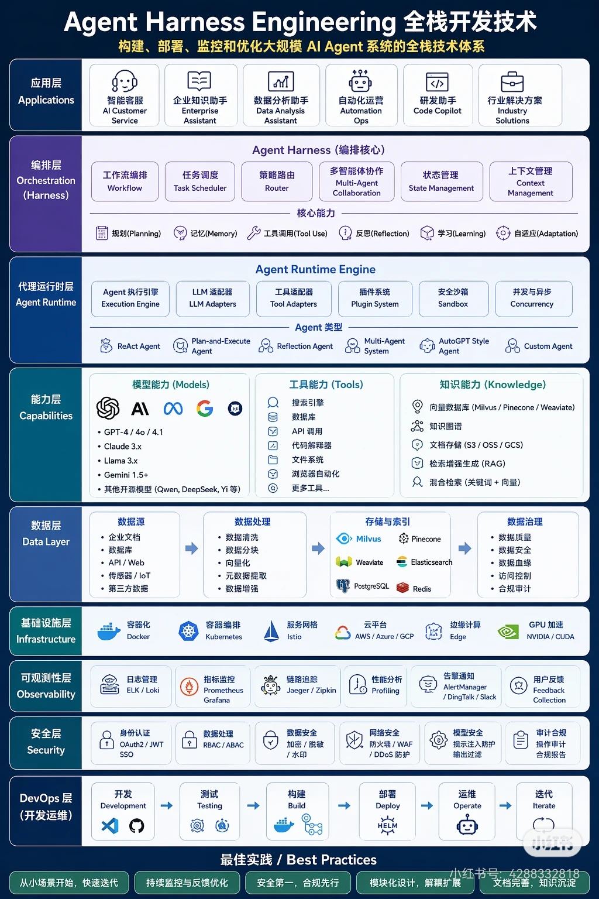

# Agent Harness Engineering 全栈开发技术

> AI Agent 的规模化落地不是单一模型问题，而是编排、运行时、模型与工具、数据、基础设施、可观测性、安全和交付流程共同组成的系统工程。

## 基本信息

- **来源类型**：用户提供的架构图
- **原文位置**：`raw/notes/2026-06-20-agent-harness-engineering-full-stack.md`
- **原始附件**：`raw/assets/agent_harness_engineering.jpg`（JPEG，1024 × 1536）
- **消化日期**：2026-06-20

## 核心观点

1. **Agent Harness 是编排核心**：它通过工作流、调度、路由、协作、状态和上下文管理组织 Agent 行为，并承载规划、记忆、工具调用、反思、学习与自适应等高阶能力。
2. **Agent Runtime 是执行底座**：执行引擎、模型/工具适配器、插件、安全沙箱与并发机制，把上层编排意图转化为可运行、可扩展的动作。
3. **模型只是能力层的一部分**：生产系统还依赖工具、知识、数据处理、存储索引和基础设施，模型选择不能替代系统设计。
4. **生产化依赖横切治理**：可观测性、安全与 DevOps 覆盖从开发到迭代的完整生命周期，使系统能够诊断、约束和持续改进。
5. **工程演进应从小场景闭环开始**：先验证单一业务价值，再通过监控反馈、模块化解耦、安全合规和知识沉淀逐步扩大系统边界。

## 关键概念

- [[Agent Harness]] — 决定 Agent 如何规划、路由和协作的编排核心。
- [[Agent Runtime]] — 承载执行、适配、隔离与并发的运行底座。
- [[Agent 可观测性]] — 用日志、指标、追踪、性能和反馈解释系统行为。
- [[Agent 安全治理]] — 贯穿身份、数据、网络、模型与审计的防护体系。
- [[Agent DevOps]] — 把开发、测试、构建、部署、运维和迭代连成闭环。

## 架构关系

- [[Agent Harness]] 定义“下一步做什么”，[[Agent Runtime]] 负责“怎样可靠地执行”。
  <!-- confidence: INFERRED -->
- [[Agent 可观测性]]提供诊断和反馈信号，[[Agent DevOps]]把这些信号带回后续迭代。
  <!-- confidence: INFERRED -->
- [[Agent 安全治理]]不是单独的末端网关，而应约束数据、工具执行、模型输入输出和操作审计。
  <!-- confidence: INFERRED -->

## 正确读图方式

这张图更适合作为能力检查表，而不是要求一次性部署全部组件的蓝图。落地时应围绕具体场景回答：需要哪些能力、每层接口是什么、状态归谁管理、失败如何恢复、指标如何定义、风险如何控制。图片没有给出这些答案。

## 原文精彩摘录

> 构建、部署、监控和优化大规模 AI Agent 系统的全栈技术体系。

> 从小场景开始，快速迭代；持续监控与反馈优化；安全第一，合规先行。

> 模块化设计，解耦扩展；文档完善，知识沉淀。

## 相关页面

- [[AI Agent 全栈工程]]
- [[Agent Harness]]
- [[Agent Runtime]]
- [[Agent 可观测性]]
- [[Agent 安全治理]]
- [[Agent DevOps]]
