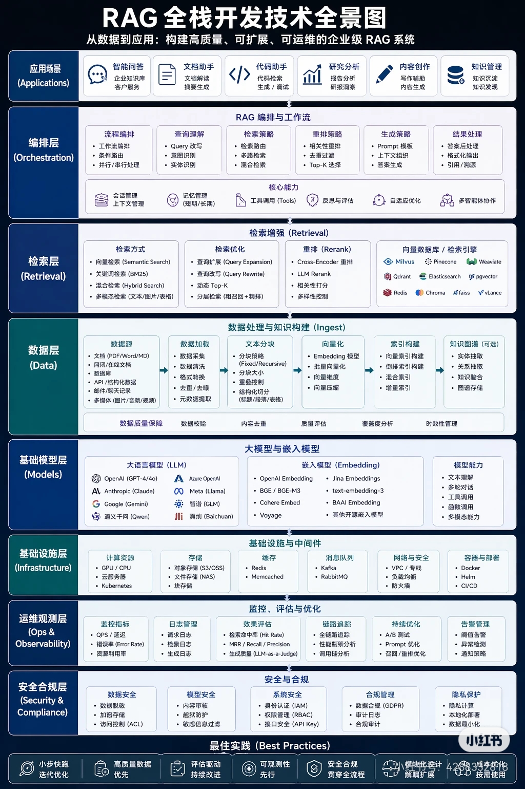

# RAG 全栈开发技术全景图

> 企业级 RAG 的难点不在“把向量库接上模型”，而在于把数据处理、检索编排、评测优化、安全合规和基础设施组织成可持续演进的系统。

## 基本信息

- **来源类型**：用户提供的架构图
- **原文位置**：`raw/notes/2026-06-20-rag-full-stack.md`
- **原始附件**：`raw/assets/rag_full_stack.jpg`（JPEG，1024 × 1536）
- **消化日期**：2026-06-20

## 核心观点

1. **RAG 是分层系统而非单点功能**：应用场景、编排策略、检索增强、数据处理、模型、基础设施、运维和安全需要协同设计。
2. **数据与检索质量决定上限**：数据清洗、分块、向量化、索引构建、重排和评测共同影响召回质量与最终答案可信度。
3. **编排层负责把“检索”变成“工作流”**：查询理解、检索路由、重排、上下文组织、结果后处理决定了 RAG 能否稳定服务真实任务。
4. **企业级落地依赖持续评测与治理**：命中率、Recall、MRR、生成质量、延迟、成本、告警和安全控制必须形成长期运营闭环。
5. **最佳实践强调渐进建设**：从高质量数据和小步快跑开始，再逐层补齐观测、安全、模块化和成本优化能力。

## 关键概念

- [[RAG 检索增强]] — 将查询理解、召回、重排和上下文组织组合成高质量知识获取链路。
- [[RAG 数据处理管道]] — 覆盖采集、清洗、分块、向量化、索引和知识构建的知识生产线。
- [[RAG 评测与优化]] — 用离线指标、链路追踪和线上实验持续提升检索与生成效果。
- [[AI Agent 全栈工程]] — RAG 可作为 Agent 的知识与检索子系统，为工具调用和任务执行提供可信上下文。

## 架构关系

- 编排层决定“何时检索、检什么、如何组织上下文”，检索层决定“能找回什么”，两者共同塑造最终答案质量。
  <!-- confidence: INFERRED -->
- 数据层是检索层的上游约束；如果分块、元数据或索引构建设计不当，重排和生成很难补救。
  <!-- confidence: INFERRED -->
- 运维观测与安全合规不是后置补丁，而是生产 RAG 的常驻能力层。
  <!-- confidence: INFERRED -->

## 读图启发

这张图最有价值的地方，是把大家容易忽略的“非模型部分”明确展开了。它提醒我们，RAG 项目真正会卡住的地方通常是数据质量、召回策略、评测闭环、权限治理和成本控制，而不是模型 API 是否接通。

## 原文精彩摘录

> 从数据到应用：构建高质量、可扩展、可运维的企业级 RAG 系统

> 监控、评估与优化

> 安全合规贯穿全流程

## 相关页面

- [[RAG 全栈工程]]
- [[RAG 检索增强]]
- [[RAG 数据处理管道]]
- [[RAG 评测与优化]]
- [[AI Agent 全栈工程]]
